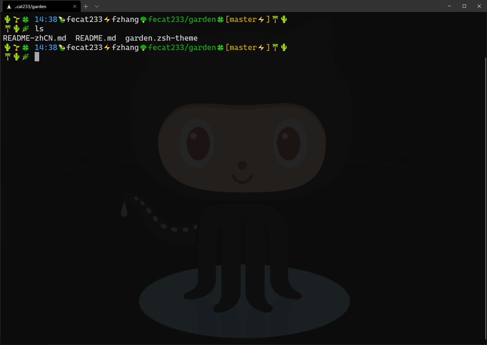

[English](README.md)
# 简介
## 预览


## 说明
这个主题的灵感来自于[CJ R.](https://github.com/w3cj)在Youtube上的频道[Coding Garden with CJ](https://www.youtube.com/channel/UCLNgu_OupwoeESgtab33CCw)。我从CJ的视屏中学到了很多东西，CJ的视屏总会带给我惊喜，我喜欢他敲击键盘的声音，以及他所使用的terminal主题，我觉得这个主题太棒了，所以我也写了一个这样的主题。
# 安装
## 预安装
要想使用这个主题，首先需要安装[Zsh](https://www.zsh.org/)和[ohmyzsh](https://github.com/ohmyzsh/ohmyzsh)
## 安装步骤
1. 克隆仓库
```bash
git clone https://github.com/fecat233/garden.git
```
2. 配置.zshrc文件
```json
ZSH_CUSTOM=$HOME/xxx/garden
ZSH_THEME="garden"
```
3. 使.zshrc生效
```bash
source ~/.zshrc
```
## License
garden已在[MIT License](LICENSE)下发布
